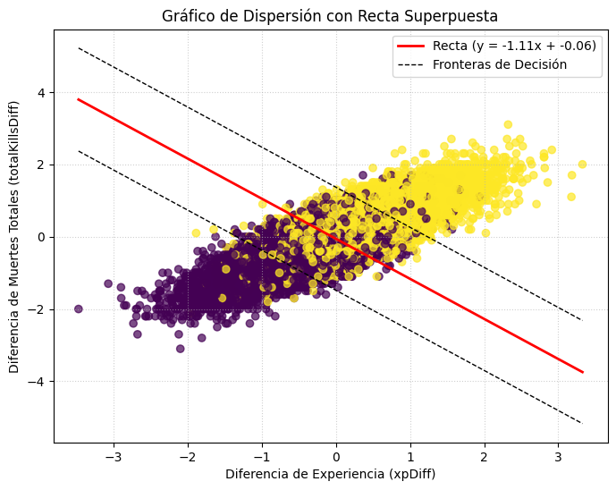
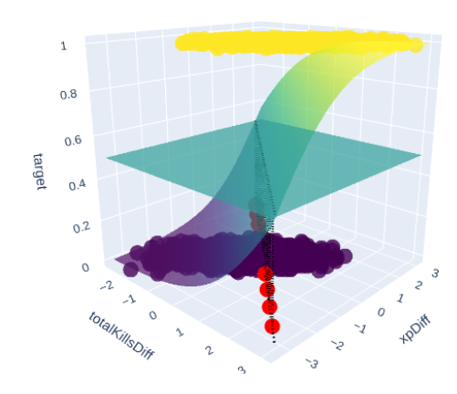
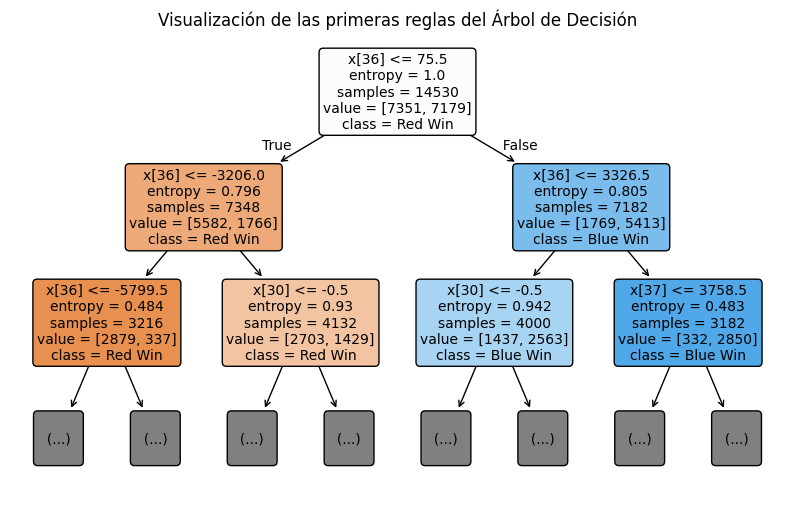
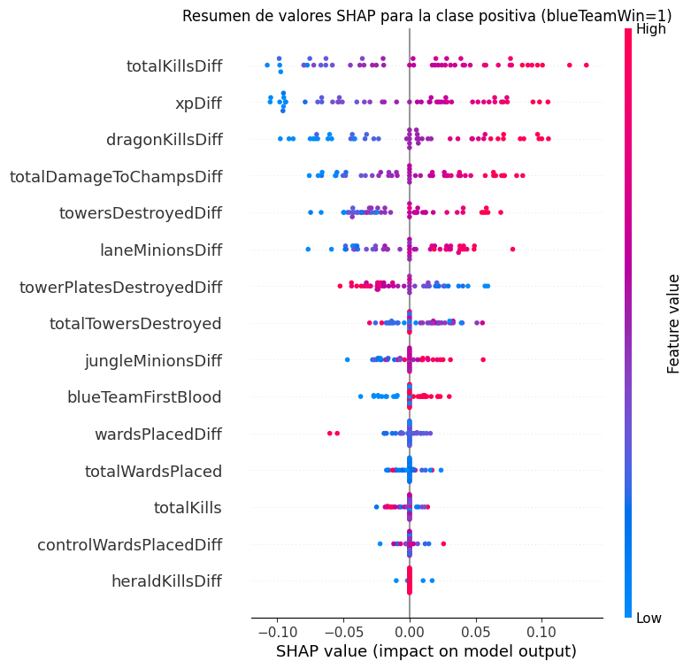

# League of Legends Win Prediction - ML Experiments

This repository contains a set of Machine Learning experiments to predict the winner of a League of Legends match based on data collected at the 10-minute mark.

## Project Overview

The goal of this project is to explore various classification algorithms and feature engineering techniques to accurately predict the outcome of a match. The project uses a dataset from Kaggle containing high-elo ranked matches.

## Dataset

*   **Source:** [League of Legends SoloQ Matches at 10 Minutes 2024](https://www.kaggle.com/datasets/karlorusovan/league-of-legends-soloq-matches-at-10-minutes-2024)
*   **Original Features:** Kills, deaths, assists, gold, experience, towers, dragons, heralds, etc., for both Blue and Red teams.
*   **Preprocessing:**
    *   **Feature Engineering:** Calculated difference features (Blue Team - Red Team) for key metrics like gold, XP, kills, etc. This helps reduce dimensionality and multicollinearity.
    *   **Data Cleaning:** Removed duplicates and irrelevant columns (`matchId`).
    *   **Scaling:** Used `RobustScaler` to handle outliers in the data.
    *   **Gold Removal:** Experiments were conducted both with and without gold-related features to test model robustness (since gold is highly correlated with winning).

## Experiments

The following algorithms were implemented and tuned using `GridSearchCV`:

### 1. Decision Tree
*   **Goal:** Establish a baseline and understand feature importance.
*   **Interpretability:** Visualized the tree structure and used SHAP values to explain predictions.
*   **Key Findings:** `totalGoldDiff` and `xpDiff` are the most dominant features.

### 2. Support Vector Machine (SVM)
*   **Goal:** Test linear and non-linear decision boundaries.
*   **Kernels Tested:** Linear, RBF, Poly, Sigmoid.
*   **Analysis:** Visualized decision boundaries in 2D and 3D space using PCA/selected features.

### 3. Logistic Regression
*   **Goal:** A simple, interpretable probabilistic model.
*   **Analysis:** Examined coefficients to understand the direction and magnitude of feature impact. Used SHAP to visualize individual predictions.
*   **Performance:** Achieved competitive accuracy with low complexity.

### 4. K-Nearest Neighbors (KNN)
*   **Goal:** Instance-based learning approach.
*   **Tuning:** Experimented with `n_neighbors`, `weights` (uniform vs. distance), and `metric` (Euclidean vs. Manhattan).
*   **Analysis:** Plotted performance vs. K to find the optimal neighborhood size.

### 5. Random Forest
*   **Goal:** Ensemble method to improve upon the single Decision Tree.
*   **Tuning:** Varied `n_estimators` and `max_depth`.

## Visualizations & Analysis

*   **SHAP Values:** Used extensively to interpret model decisions locally and globally.
*   **t-SNE:** Dimensionality reduction to visualize class separability in 2D.
*   **LDA (Linear Discriminant Analysis):** Visualized the separation of classes along the most discriminative axis.
*   **Learning Curves:** Analyzed bias-variance tradeoff and the impact of regularization.

## Results

*   The models generally achieved an accuracy of around **76%** on the test set.
*   Gold difference and experience difference were consistently identified as the strongest predictors.
*   The "No Gold" experiments showed that models could still predict winners with reasonable accuracy using only kills, objectives, and experience.

## File Structure

*   `Completo.ipynb`: The main notebook containing the full pipeline: data loading, preprocessing, all model experiments, and final evaluation.
*   `preproc.ipynb`: Dedicated notebook for data cleaning and feature engineering (generating `.csv` files in `data/`).
*   `src/`: Contains modular notebooks for specific algorithms (SVM, KNN, Decision Trees, etc.).

## Plots

|  |
|:--:| 
| *Modelo SVM* |

|  |
|:--:| 
| *Modelo de Regresión Logística* |

|  |
|:--:| 
| *Modelo de Árboles de Decisiones* |

|  |
|:--:| 
| *Shapely values del modelo KNN* |

